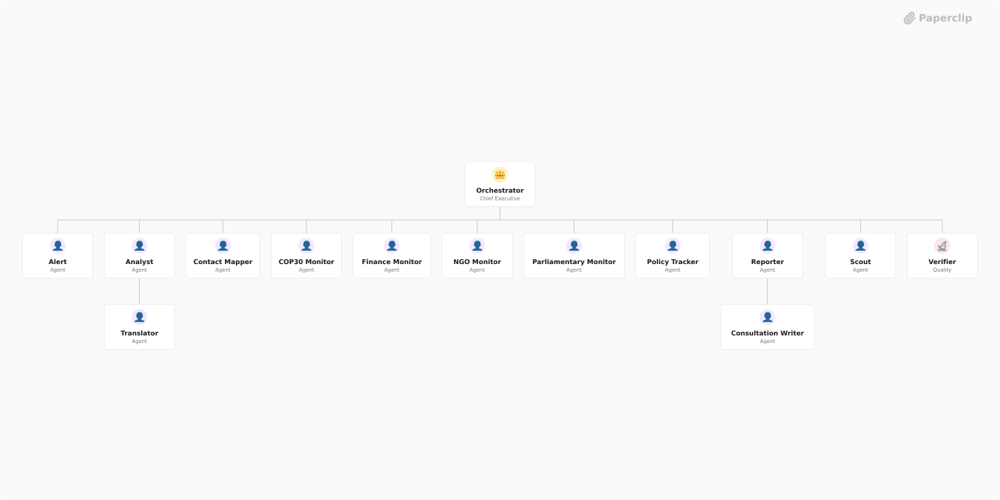

# Climate Intelligence Platform — Brazil

> Monitor and analyse Brazil's energy policy landscape to accelerate renewable energy adoption and influence the transition away from fossil fuels. Provide the team with verified, source-cited intelligence on government policy, regulation, and key decision-makers — so every campaign and advocacy decision is grounded in evidence.



## What's Inside

> This is an [Agent Company](https://agentcompanies.io) package from [Paperclip](https://paperclip.ing)

| Content | Count |
|---------|-------|
| Agents | 14 |
| Projects | 2 |
| Skills | 4 |
| Tasks | 1 |

### Agents

| Agent | Role | Reports To |
|-------|------|------------|
| Alert | researcher | orchestrator |
| Analyst | researcher | orchestrator |
| Consultation Writer | general | reporter |
| Contact Mapper | general | orchestrator |
| COP30 Monitor | researcher | orchestrator |
| Finance Monitor | researcher | orchestrator |
| NGO Monitor | researcher | orchestrator |
| Orchestrator | CEO | — |
| Parliamentary Monitor | researcher | orchestrator |
| Policy Tracker | researcher | orchestrator |
| Reporter | general | orchestrator |
| Scout | researcher | orchestrator |
| Translator | researcher | analyst |
| Verifier | qa | orchestrator |

### Projects

- **COP30 & Brazil Energy Transition Monitoring** — Monitor COP30 preparatory documents, Brazil NDC updates, fossil fuel coalition strategy, and civil society engagement opportunities for the Climate Intelligence Platform.
- **Onboarding**

### Skills

| Skill | Description | Source |
|-------|-------------|--------|
| paperclip-create-agent | > | [github](https://github.com/paperclipai/paperclip/tree/master/skills/paperclip-create-agent) |
| paperclip-create-plugin | > | [github](https://github.com/paperclipai/paperclip/tree/master/skills/paperclip-create-plugin) |
| paperclip | > | [github](https://github.com/paperclipai/paperclip/tree/master/skills/paperclip) |
| para-memory-files | > | [github](https://github.com/paperclipai/paperclip/tree/master/skills/para-memory-files) |

## Getting Started

```bash
pnpm paperclipai company import this-github-url-or-folder
```

See [Paperclip](https://paperclip.ing) for more information.

---
Exported from [Paperclip](https://paperclip.ing) on 2026-04-06
